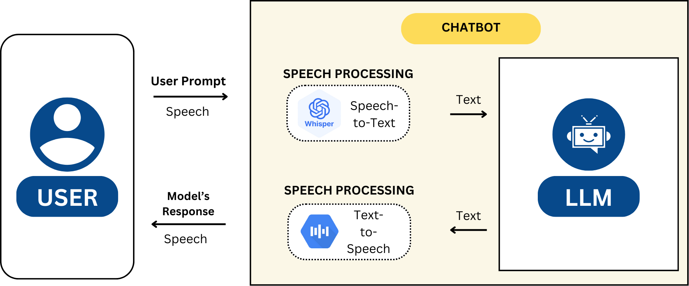
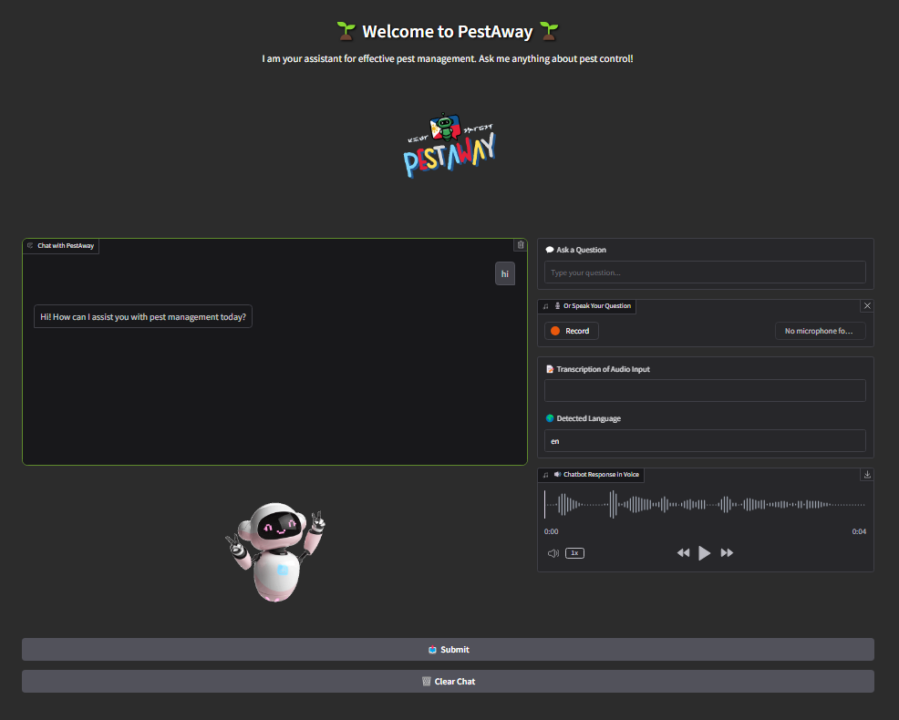

<p align="center">
  
</p>

<h1 align="center">🌾 Pestaway</h1>

<p align="center">
  <em>Pest Management Chatbot with Integrated Speech Capability</em>
</p>

<p align="center">
  <a href="https://ieeexplore.ieee.org/document/11375077">
    
  </a>
  
  
</p>

<p align="center">
  <a href="https://ieeexplore.ieee.org/document/11375077"><b>📄 Paper</b></a>
  •
  <a href="https://pestaway-ust.github.io/"><b>🌐 Project Page</b></a>
  •
  <a href="https://github.com/pestaway-ust/pestaway-ust.github.io/tree/main/docs/codes"><b>💻 Code</b></a>
</p>

<hr/>

## 📌 Overview

**Pestaway** is a bilingual (English–Tagalog) conversational assistant designed to support Filipino farmers in pest identification and safe mitigation.  
It supports both **text** and **speech** interaction, suitable for field use and modest hardware deployment.

**Core components**
- 🎙️ Whisper (Speech-to-Text)
- 🧠 SeaLLM-v3-1.5B-Chat (fine-tuned via SFT / DPO / ORPO)
- 🔊 Google Text-to-Speech (gTTS)

---

## 🖥️ Demo Screenshot

<p align="center">
  
</p>

> Tip: If this still looks too big on your screen, change `width="780"` to `650`.

---

## 🗂 Repository Structure

```
.
├── README.md
└── docs/                       # GitHub Pages source
    ├── index.html              # Project website
    ├── architecture.png
    ├── pestaway-gui.png
    └── codes/                  # Sanitized scripts (public)
        ├── sft_training.py
        ├── orpo.py
        ├── dpotrainer3.py
        ├── evaluate_model.py
        ├── data_metrics.py
        ├── coh_metrix*.py
        ├── WEReval.py
        ├── cleaner.py
        ├── count.py
        ├── testing_gradio.py
        └── requirements.txt
```

---

## 🔁 Reproducibility

### 1) Setup

```bash
python -m venv venv
source venv/bin/activate          # macOS/Linux
# or
venv\Scripts\activate             # Windows
pip install -r docs/codes/requirements.txt
```

### 2) Environment Variables (No hardcoding)

```bash
export HF_TOKEN="your_huggingface_token"
export TRAIN_PARQUET="./data/train.parquet"
export TEST_PARQUET="./data/test.parquet"
```

Windows PowerShell:

```powershell
setx HF_TOKEN "your_huggingface_token"
setx TRAIN_PARQUET ".\data\train.parquet"
setx TEST_PARQUET ".\data\test.parquet"
```

### 3) Training

```bash
python docs/codes/sft_training.py
python docs/codes/orpo.py
python docs/codes/dpotrainer3.py
```

### 4) Evaluation

```bash
python docs/codes/evaluate_model.py
```

Metrics include:
- METEOR
- BERTScore
- Average Perplexity
- Coh-Metrix features

---

## 📊 Results (Summary)

| Method    | METEOR | BERTScore | Avg. Perplexity |
|----------|--------:|----------:|----------------:|
| SFT      | 0.2909  | 0.6250    | 2.6040          |
| SFT+DPO  | 0.2896  | 0.6596    | 2.0501          |
| ORPO     | **0.3271** | **0.7316** | **1.5185**   |

---

## 📜 Citation

```bibtex
@inproceedings{delacruz2025pestaway,
  title     = {Pestaway: A Pest Management Chatbot with Integrated Speech Capability},
  author    = {Dela Cruz, Rachel Hannah C. and Aguarin, Joshua Carlo C. and
               Ling, Nickolas Chase P. and Magsaysay, Maveric S. and
               Villanueva, Jastin Brylle C. and Pangaliman, Ma. Madecheen S.},
  booktitle = {2025 IEEE Region 10 Conference (TENCON)},
  year      = {2025},
  month     = {October},
  address   = {Kota Kinabalu, Sabah, Malaysia},
  doi       = {10.1109/TENCON66050.2025.11375077},
  url       = {https://ieeexplore.ieee.org/document/11375077}
}
```

---

## 🙏 Acknowledgment

Department of Electronics Engineering, Faculty of Engineering, University of Santo Tomas  
Bulacan Agricultural State College and local farming communities in Bulacan

---

⭐ If this repository helps your work, please consider starring the project.
